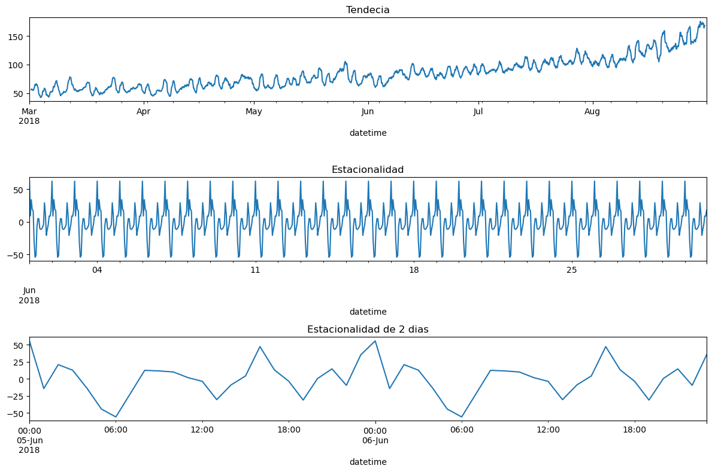

## Predicción de Demanda de Taxis — Sweet Lift Taxi

En el competitivo sector del transporte urbano, anticiparse a los picos de demanda es clave para **mejorar la eficiencia operativa**, **incrementar los ingresos** y **optimizar la experiencia del cliente**. En este proyecto, desarrollé un modelo de predicción horaria de pedidos de taxi con el objetivo de **anticipar la demanda en aeropuertos** y así facilitar la asignación eficiente de unidades durante las horas pico.

#### 🛠️Herramientas y tipo de proyecto

### Objetivo
Construir un modelo de predicción que anticipe la **cantidad de pedidos de taxi por hora**, permitiendo a la empresa tomar decisiones proactivas y estratégicas de operación logística.

### Metodología

- **Preprocesamiento y remuestreo temporal:** Los datos fueron resampleados a una frecuencia de 1 hora para capturar la estacionalidad y patrones horarios.
- **EDA y descomposición estacional:** Se aplicó `seasonal_decompose` para visualizar tendencias, ciclos y residuos en la serie temporal.
- **Ingeniería de características:** Se incorporaron variables como "hora del día", "día de la semana" y estadísticas móviles para enriquecer la información temporal.
- **Modelado predictivo:** Se utilizó **LightGBM** por su eficiencia y rendimiento sobre datos tabulares. Se entrenaron modelos ajustando hiperparámetros y evaluando su desempeño con la métrica RMSE.
- **Validación temporal:** Se dividió el dataset en conjuntos de entrenamiento, validación y prueba, respetando la estructura secuencial de las series temporales.

### Resultados y beneficios

El modelo logró una excelente capacidad de predicción en el conjunto de entrenamiento, con un RMSE de **19.27**, mientras que en la etapa de validación se obtuvo un RMSE de **34.66**. En el conjunto final de prueba, el RMSE fue de **54.91**, manteniéndose dentro de un margen razonable para aplicaciones prácticas.

El tiempo total de ejecución fue de **0.10 segundos**, demostrando que el modelo no solo es preciso, sino también altamente eficiente.

> Esta solución permite prever con anticipación la demanda horaria de taxis en aeropuertos, optimizando la **asignación de unidades**, reduciendo los **tiempos de espera** y mejorando la **experiencia del usuario y la eficiencia operativa**.

### Visualizaciones destacadas

1. **Análisis de componentes temporales:** En la primera gráfica se observa una clara tendencia creciente en la serie. La segunda muestra una estacionalidad recurrente con un ciclo aproximado de 2 meses, mientras que la tercera revela patrones estacionales diarios con una periodicidad de 2 días.

1. **Análisis de componentes temporales:** En la primera gráfica se observa una clara tendencia creciente en la serie. La segunda muestra una estacionalidad recurrente con un ciclo aproximado de 2 meses, mientras que la tercera revela patrones estacionales diarios con una periodicidad de 2 días.

